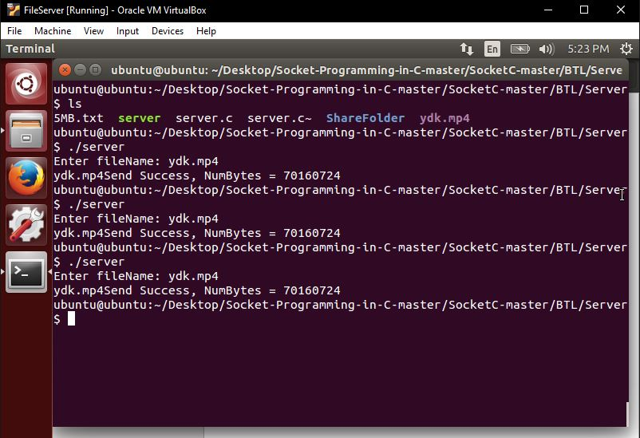

<h1>Báo cáo bài tập lớn </h1>

Chương trình truyền file sử dụng C để viết

Trên File Server chờ kết nối của Client1 
Sau khi kết nối thì nhập tên file cần phân phối cho Client

Sau khi Server có lệnh phân phối file Client1 bắt đầu nhận file do Server gửi.
 Sau khi nhận file từ Server xong Client bắt đầu gửi file cho Client2 và Client3 trong mạng
 Do băng thông trong mạng lớn nên quá trình gửi rất nhanh. Được tính dựa theo hàm date lúc trước khi chạy và sau khi chạy xong.
 Mất 7s cho việc truyền file ydk.mp4 có dung lượng 66MB

Hình ảnh Client2 chờ file từ Client1 và nhận file hoàn thành
 

Hình ảnh Client3 chờ file từ Client1 và nhận file hoàn thành

